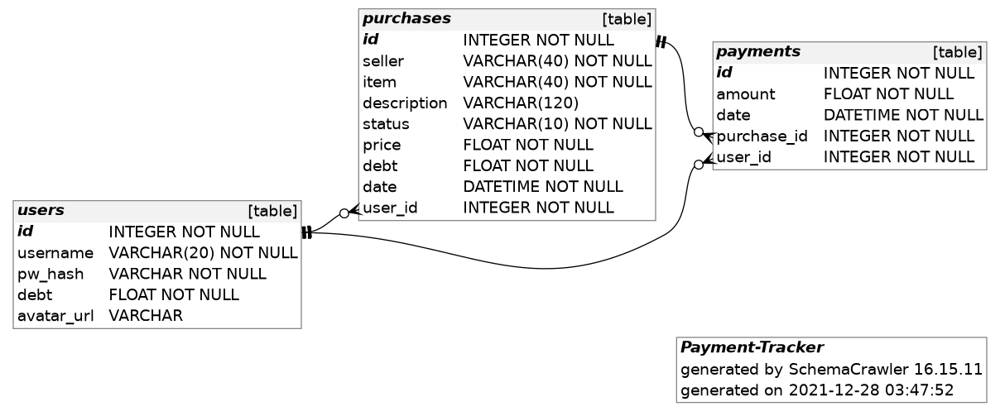

# Payment Tracker

Payment Tracker is a [Flask](https://flask.palletsprojects.com/en/2.0.x/)-based
application that aims to simplify the tracking of purchases and payments.

The backend is a SQL database with [SQLite](https://www.sqlite.org/index.html)
as the engine and [Flask's
SQLAlchemy](https://flask-sqlalchemy.palletsprojects.com/en/2.x/) as a way to
manipulate the data within.

The database is composed of tree tables: ***users***, ***purchases*** and
***payments***. The ***users*** table holds a **one-to-many** relationship with
***purchases***, which, in turn, holds a **one-to-many** relationship with
***payments***.

That is, one **user** can have many **purchases** but a **purchase** can only be
associated with a single **user**. The same applies to **purchases** and
**payments** where a **payment** can only be associated with a single
**purchase** but a **purchase** can have many **payments** associated with it.

A visual representation of the relationships between tables made using
[SchemaCrawler](https://www.schemacrawler.com/)[^schemacrawler] can be seen
below.



For more details regarding the implementation of the data model see
[dbschema.py](#dbschemapy).


## Setup
The recommended setup this application is by using python's implementation of
[virtual environments](https://docs.python.org/3/library/venv.html). Using a
virtual environment helps prevent conflicts between packages required by the
project and the ones installed in the host machine.

This project depends[^dependencies] on the following packages:
1. Flask: web framework written in Python.
2. Flask's SQLAlchemy extension: ORM to interact with the database using
   Python.
3. Flask's Session interface.

To set things up[^setup], run the following:
``` bash
python -m venv .flask # where .flask is any directory name for the virtual environment
source .flask/bin/activate # activate python's virtual environment for the current terminal
pip install -r requirements.txt # install dependencies
```

To run the server (and in turn the application), simply run:
``` bash
flask run # make sure the virtual environment is active before executing this
```

The database and tables therein should be created automatically
whenever[^table_creation] the application is ran.

With that, the application should be up and available at `localhost:5000`.


## Implementation details
### `app.py`
This is the main file for the project. Three main actions are performed in this
file:
1. `Flask` is configured along with the predefined [routes](#routes) and their
   allowed methods.
2. Database schemas are imported from [dbschema.py](#dbschemapy) and missing
   tables are created.
3. `Flask` is configured to use sessions.

##### Routes
Every single route but `login` and `register` are decorated with
`login_require`, a function defined in [utils.py](#utilspy), to make sure a
user session is active in order to have access to the application.

| Route   | Methods    | Description    |
| --- | --- | --- |
| `/`          | `GET`         | Display a summary of transactions in table form for the currently logged user. The table contains the number of purchases, payments, current debt and total amount spent. |
| `/login`     | `GET`, `POST` | Allow a user to login using their credentials: 'username' and 'password'. |
| `/logout`    | `GET`         | Log out the current user by clearing the session. |
| `/register`  | `GET`, `POST` | Allow new users to register by providing a unique 'username' and a secure 'password'. |
| `/purchase`  | `GET`, `POST` | Allow the user to register a new purchase by providing a 'seller', 'item', 'price', 'status' and optionally a 'description'. |
| `/purchases` | `GET`         | Display all purchases registered by the current user. The purchases are split into two tables: 'Cleared' (already paid) and 'Pending' (to be paid).<br>Each table shows the following information: 'item', 'seller', 'description', 'price', 'debt' and 'date'. |
| `/payment`   | `GET`, `POST` | Allow the user to register a new payment to an existing 'Pending' purchase by selecting a purchase from a drop-down menu and providing an 'amount' to pay. |
| `/payments`  | `GET`         | Display all payments registered by the current user in table format. The table contains the following information: 'item', 'seller', 'price', 'amount' and 'date'. |

### `dbschema.py`
The data model is declared here using Python classes to define the data tables,
their names, columns, data types and relationships.

The three tables used in this project are declared here as the classes:
- ***User***: this table contains all users registered in the application and
  has a *one-to-many* relationship with ***Purchase***.

| Column | Data Type | Description |
| --- | --- | --- |
| `id` | `Integer` | Unique identifier. |
| `username` | `String` | Unique username. |
| `pw_hash` | `String` | User's password hash. |
| `debt` | `Float` | User's current debt. |
| `avatar_url` | `String` | URL to the user's avatar picture. |

- ***Purchase***: this table contains all purchases registered by any user in
  ***User*** and has a *one-to-many* relationship with ***Payment***.

| Column | Data Type | Description |
| --- | --- | --- |
| `id` | `Integer` | Unique identifier. |
| `seller` | `String` | Seller name. |
| `item` | `String` | Name of the item. |
| `description` | `String` | Brief description of the item. |
| `status` | `String` | Status of the purchase. |
| `price` | `Float` | Price of the item. |
| `debt` | `Float` | Amount left to be paid. |
| `date` | `DateTime` | Date and time of the purchase. |
| `user_id` | `Integer` | Reference to the user who made the purchase. |

- ***Payment***: this table contains all payments registered for any purchase in
  ***Purchase***.

| Column | Data Type | Description |
| --- | --- | --- |
| `id` | `Integer` | Unique identifier. |
| `amount` | `Float` | Amount to be paid. |
| `date` | `DateTime` | Date and time of the payment. |
| `purchase_id` | `Integer` | Reference to the purchase the payment belongs to. |
| `user_id` | `Integer` | Reference to the user who made the payment. |

### `utils.py`
This file contains helper functions used either within [app.py](#apppy) or as
filters for [jinja](https://jinja.palletsprojects.com/en/3.0.x/)
[templates](#templates) .

Among the functions defined in this file we have:
- `login_required`: CS50's function used in [app.py](#apppy) to require an
  active user session to access the application.
- `apology`: an extended version of CS50's `apology` function. This version
  allows you to specify the meme to be used from [memegen
  API](https://github.com/jacebrowning/memegen) as well as the top and bottom
  text.
- `formatter`: a function to be used as a custom jinja filter that allows you to
  format the input based on its data type.
- `meets_security_check`: a function to check if the password the user provided
  meets an arbitrary security standard.

### `static`
This directory contains files that are not being rendered or modified at
run-time.

#### `style.css`
This file has all CSS needed to achieve the application's look and fell. It
contains the code generated by Tailwind as well as a few custom classes.

#### `utils.js`
This project is very short in javascript and, thus, this file contains a single
`eventListener` attached to a button responsible for the toggling of the
sidebar.

### `templates`
This directory contains all the HTML/jinja templates used in this project.

These files are used to render data dynamically to match the current user. That
is, every file in here either receives data directly from [app.py](#apppy) or
fetches it from the current active session.

### `requirements.txt`
This file has a list of package dependencies this project needs in order to run.
It is meant to be used with `pip` as specified in the [setup](#setup) section.


## Technical challenges
* Learn a new CSS framework in [Tailwind](https://tailwindcss.com/).
    * I wanted to learn something different and maybe less opinionated to work
      with CSS.
    * I found Tailwind's approach to predefined CSS classes very interesting.
      Instead of giving you a lot of objects with a predefined look-and-feel,
      Tailwind gives you buildingblock classes of sort (all of them you can mix
      and match), with which to achieve a custom look.
    * Although there is a bit of a learning curve in regards of the class names
      Tailwind provides and the setup can be a bit cumbersome, in general I
      found working with this framework a very rewarding experience.
* Learn an ORM (Object-Relational Mapper) framework between SQL and python in
  [Flask's SQLAlchemy](https://flask-sqlalchemy.palletsprojects.com/en/2.x/).
    * While it is possible to use direct SQL commands within Python using
      wrappers like the one provided by CS50, I wanted to learn a new way to
      interact with a database within Python in a more "pythonic" way.
    * SQLAlchemy uses classes to declare the tables and schemas within a
      database, which, depending on the how confortable you are with Python, can
      make handling data of distict types a much easier process.
    * This framework also allows to create relationships between tables, which
      is something I wanted for this project. However, since I've never done
      that with this framework, I had to learn how to interconnect tables to
      reduce redundancy.


## Future development
* Use [jquery](https://jquery.com/) to make the site more dynamic, that is, show
  related information whenever a purchase is clicked.
* Use `jquery` to allow the user to make searches through in input field instead
  of having to look for them manually.
* Allow the user to sort tables based on which column header is clicked.
* Allow the user to change their avatar.

[^dependencies]:
    The list package dependencies are listed in the file
    [requirements.txt](./requirements.txt).
[^setup]:
    The setup instructions are intended for Linux and maybe MacOS users. The
    paths and commands may vary for Windows users.
[^table_creation]:
    SQLAlchemy provides the command `create_all()` which first checks if the
    tables exist in the specified database and creates them if they don't.
[^schemacrawler]:
    This tool is seriously powerful. However I just used to create the
    representation of the database.
